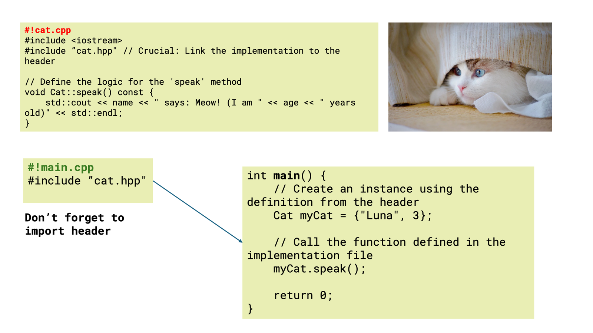

## **User Guide: Building Code with `pptx-probe`**

`pptx-probe` allows you to treat your PowerPoint slides as a visual IDE. By using specific markers and connectors, you can define file structures and logical flows directly on your slides.

---

| | |
|:---:|:---:|
|  |  |

### **1. Defining a File (The Root Block)**

To create a new source file, start a text box with the **shebang marker** `#!` followed by your desired filename. 

* **Example:** `#!cat.hpp` or `#!main.cpp`.
* This tells the parser: *"Everything in this box (and its connected chain) belongs to this file."*

### **2. Chaining Code Blocks (The Visual Logic)**

You don't have to fit all your code into one box. `pptx-probe` uses PowerPoint's **Connector Lines** and **Arrows** to build a continuous stream of code.

* **How it works:** If an arrow points from **Box A** to **Box B**, the content of Box B is appended directly after the content of Box A in the final file.
* **Non-code elements:** Any text box that *does not* start with `#!` and is *not* pointed to by an arrow is treated as a "comment" or "annotation" for the human reader and is **ignored** by the parser.

---

### **3. Detailed Example Walkthrough**

Based on the example slides, here is how the code is generated:

#### **Slide 1: Header Definition (`cat.hpp`)**
* **Root:** The box starting with `#!cat.hpp` defines the C++ header.
* **Interaction:** Notice the arrow pointing from the "Very important" note back to the code. Since the arrow points *to* the code from a non-code box, the note is ignored, but the code remains intact.

#### **Slide 2: Implementation & Main**
* **Standalone File:** The box `#!cat.cpp` stands alone. It contains the logic for the `speak` method. 
* **The Chain (`main.cpp`):** 1. The parser finds the root box `#!main.cpp` containing `#include "cat.hpp"`.
    2. It follows the **arrow** to the larger yellow box.
    3. It appends the `int main()` function to the same `main.cpp` file.
* **The "Don't forget" Note:** Since no arrow points *from* this note to a code block, it is ignored by the build process.

---

### **Cheat Sheet**

| Element | Syntax / Action | Result |
| :--- | :--- | :--- |
| **New File** | Start box with `#!filename.ext` | Creates `filename.ext`. |
| **Continue Code** | Draw an **Arrow** | Appends target box text to current file.  |
| **Annotations** | Text box with no arrows | Ignored by parser (used for notes). |
| **Visuals** | Images, cats, or shapes | Ignored by parser. |

> **Important:** Ensure your arrows are physically **anchored** to the text box connection points in PowerPoint. This ensures the `pptx-probe` parser correctly detects the relationship between blocks!